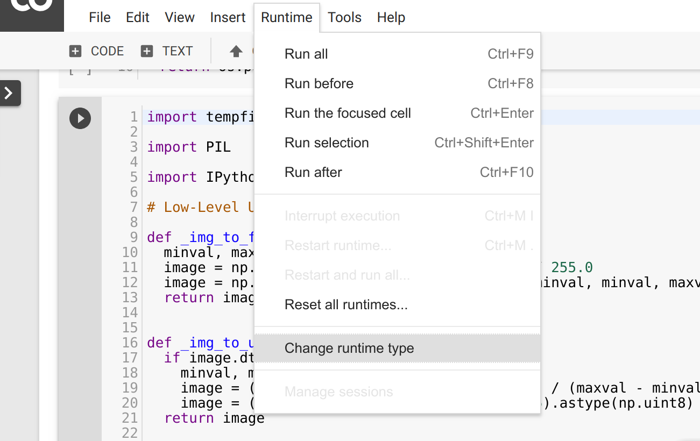
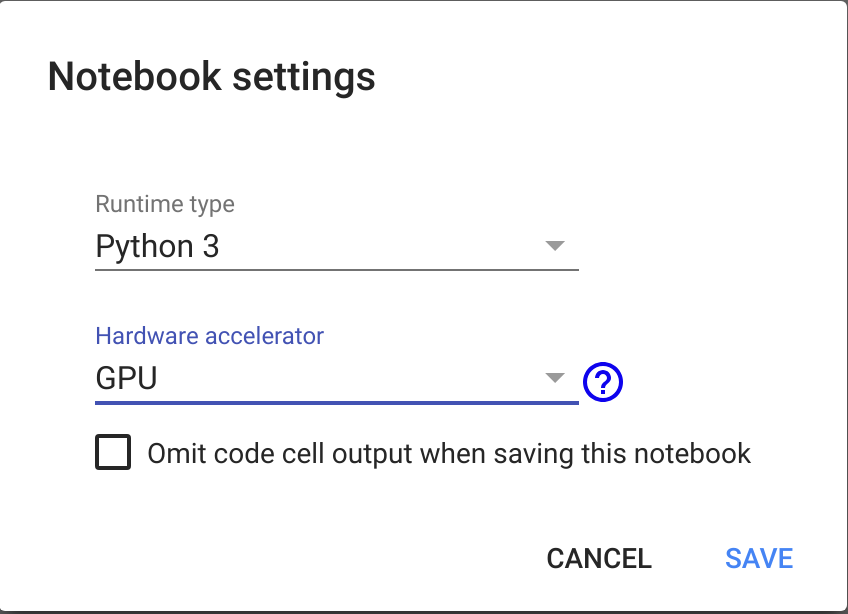

# Assignment 5: Deep Image Prior

**Due Date:** Feb 10, 2019.  
**Submission:** in pairs, [here](https://www.dropbox.com/request/RnWMrpAGjnhKmJvU4C3q).

## Submission
You should work on the exercise in pairs, and upload it to the [submission box](https://www.dropbox.com/request/RnWMrpAGjnhKmJvU4C3q).

You should submit a single zip-file, `ex5-dip.zip`, with the following files:
1. `ex5-dip.pdf`: your report.
2. `ex5-dip.ipynb`: your notebook.
4. `STUDENTS`: your details (use the provided template).

## Colab
In this assignment, you're highly encouraged to work in [Google Colab](https://colab.research.google.com/).

### Load notebook
1. Clone the repositry to your computer.
2. Browse to [Google Colab](https://colab.research.google.com/).
3. Select the **UPLOAD** tab.
3. Upload the notebook `ex5-dip.ipynb`.

### Enable GPU
1. Choose **Runtime -> Change runtime type** in the menu. 
2. Select "GPU" as **Hardware accelerator**. 
